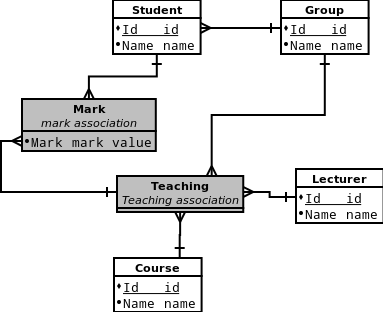
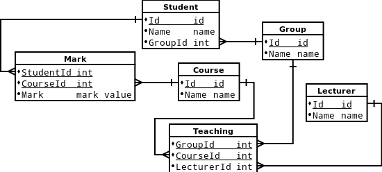

# HW4 for DBMS course, 09 October 2015.

_**Made by George Agapov, group M3437**_

## Relation and it\'s dependencies

Student_Id, Student_Name, Group_Id, Group_Name, Course_Id, Course_Name, Lecturer_Id, Lecturer_Name, Mark

### Functional dependencies

1. Student_Id -> Student_Name
2. Group_Id -> Group_Name
3. Group_Name -> Group_Id
4. Course_Id -> Course_Name
5. Lecturer_Id -> Lecturer_Name
6. Group_Id Course_Id -> Lecturer_Id
7. Student_Id -> Group_Id
8. Student_Id Course_Id -> Mark

## Normal Forms

For purpose of demonstrating (difference between 3-NF and BCNF) let\'s omit Group_id, Group_Name and start with initial relation:
    
    Student_Id, Course_Id, Student_Name, Course_Name, Lecturer_Id, Lecturer_Name, Mark

### 1-NF

* no repeating groups
* atomic attributes
* there exist a key

_Student_Id_, _Course_Id_, Student_Name, Course_Name, Lecturer_Id, Lecturer_Name, Mark

### 2-NF

* 1-NF
* Non-key attributes depend on whole key

1. _Student_Id_, Student_Name
1. _Course_Id_, Course_Name
1. _Student_Id_, _Course_Id_, Lecturer_Id, Lecturer_Name
1. _Student_Id_, _Course_Id_, Mark

### 3-NF

* 2-NF
* Non-key attribute immidiately depend on keys (not through transitivity)

1. _Student_Id_, Student_Name
1. _Course_Id_, Course_Name
1. _Student_Id_, _Course_Id_, Lecturer_Id
1. _Lecturer_Id_, Lecturer_Name
1. _Student_Id_, _Course_Id_, Mark

### BCNF

* For every non-trivial functional dependency `X->Y`: `X` is a super key

1. _Student_Id_, Student_Name (#1)
1. _Course_Id_, Course_Name (#4)
1. _Student_Id_, Group_Id (#7)
1. _Group_Id_, Group_Name (#2,3)
1. _Group_Id_, _Course_Id_, Lecturer_Id (#6)
1. _Lecturer_Id_, Lecturer_Name (#5)
1. _Student_Id_, _Course_Id_, Mark (#8)

### 4-NF

* 3-NF
* A record type should not contain two or more independent multi-valued facts about an entity

(_Student_Id_, _Course_Id_), (_Group_Id_, _Course_Id_) - multi-valued facts, but only two

So, 4-NF is same as BCNF

### 5-NF

5-NF is same as BCNF

## ERM

## PDM

## SQL for tables\' creation

    CREATE TABLE Student (
      Id SERIAL NOT NULL PRIMARY KEY,
      Name VARCHAR (50) NOT NULL,
      GroupId INT NOT NULL
    );
    CREATE TABLE Lecturer (
      Id SERIAL NOT NULL PRIMARY KEY,
      Name VARCHAR (50) NOT NULL
    );
    CREATE TABLE StudentGroup (
      Id SERIAL NOT NULL PRIMARY KEY,
      Name VARCHAR (50) NOT NULL UNIQUE
    );
    CREATE TABLE Course (
      Id SERIAL NOT NULL PRIMARY KEY,
      Name VARCHAR (50) NOT NULL
    );
    CREATE TABLE Teaching (
      GroupId INT NOT NULL,
      CourseId INT NOT NULL,
      LecturerId INT NOT NULL,
      PRIMARY KEY (GroupId, CourseId)
    );
    CREATE TABLE Mark (
      StudentId INT NOT NULL,
      CourseId INT NOT NULL,
      Mark DECIMAL (4, 2) NOT NULL,
      PRIMARY KEY (StudentId, CourseId)
    );
  
    ALTER TABLE Student ADD CONSTRAINT FK_Student_GroupId FOREIGN KEY (GroupId) REFERENCES StudentGroup (Id);
    ALTER TABLE Teaching ADD CONSTRAINT FK_Teaching_LecturerId FOREIGN KEY (LecturerId) REFERENCES Lecturer (Id);
    ALTER TABLE Teaching ADD CONSTRAINT FK_Teaching_GroupId FOREIGN KEY (GroupId) REFERENCES StudentGroup (Id);
    ALTER TABLE Teaching ADD CONSTRAINT FK_Teaching_CourseId FOREIGN KEY (CourseId) REFERENCES Course (Id);
    ALTER TABLE Mark ADD CONSTRAINT FK_Mark_CourseId FOREIGN KEY (CourseId) REFERENCES Course (Id);
    ALTER TABLE Mark ADD CONSTRAINT FK_Mark_StudentId FOREIGN KEY (StudentId) REFERENCES Student (Id);
    ALTER TABLE Mark ADD CONSTRAINT CH_Mark_Mark CHECK (Mark >= 0 AND Mark <= 100);

### Create database

    echo "DROP DATABASE hw4; CREATE DATABASE hw4" | psql; psql -d hw4 < schema.sql

## Data set

    INSERT INTO StudentGroup (Id, Name) VALUES (1, 'M3437'), (2, 'M3338');
    INSERT INTO Student (Id, Name, GroupId)
    VALUES (1, 'George Agapov', 1), (2, 'George Konoplich', 1),
           (3, 'Mikhail Ivanov', 2), (4, 'Alina Ruslanova', 2);
    INSERT INTO Lecturer (Id, Name) VALUES (1, 'George Korneev'), (2, 'Andrew Stankevich'), (3, 'Ivan Sorokin');
    INSERT INTO Course (Id, Name) VALUES (1, 'Java: basic'), (2, 'Java: advanced'),
           (3, 'Translation methods'), (4, 'C++'), (5, 'Discrete math: semester 3');
    INSERT INTO Teaching (GroupId, CourseId, LecturerId) VALUES (2, 1, 1), (1, 4, 3);
    INSERT INTO Mark (StudentId, CourseId, Mark) VALUES (1, 4, 90), (2, 4, 70), (3, 1, 85), (4, 1, 67);
