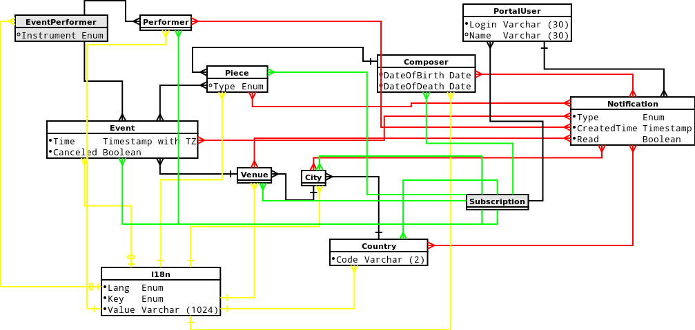

# База концертов классической музыки

Курсовой проект по предмету "Базы данных". Университет ИТМО, Январь 2016.

_**Выполнил Георгий Агапов, группа M3437**_

## ERM

## PDM

## Описание сущностей

| Сущность  | Описание      |
| :-----    | :-------------|
| Composer  | Композитор |
| Piece | Музыкальное произведение |
| Venue | Концертная площадка (театр, концертный зал) |
| Event | Событие (концерт) |
| City | Город |
| Country | Страна |
| PortalUser | Пользователь сервиса (портала) |
| Notification | Уведомления для пользователя (при появлении нового события, отмене старого) |
| Subscription | Подписки пользователя (на сущности, для которых пользователь хочет получать уведомления) |

На ERM и PDM диаграмах для всех сущностей указаны поля, которые они содержат.

Кроме того большинство сущностей содержат переводимые поля, которые хранятся в "общей" сущности `I18n`.

Рассмотрим поля таблицы I18n:

 * `EntityType :: Enum (Composer, Piece, Venue, City, Country, Event, EventPerformer)` - тип сущности, для которой хранится перевод
 * `EntityId :: Int` - Id сущности (предполагается, что у сущности должен быть суррогатный целочисленный ключ)
 * `Key :: Enum (Name, Role, Address)` - ключ, к сущности может быть привязано до нескольких пар ключ-значение
 * `Lang :: Enum (ru, en, ge)` - язык
 * `Value :: String` - перевод

Сущности неявно ссылаются на таблицу `I18n`. В качестве `EntityType` используется название таблицы сущности, в качестве `EntityId` - ключ.
Аналогичный механизм используется для таблиц `Subscription`, `NotificationEntity`.

В следующей таблице перечисленны все поля, хранимые в `I18n`:

| Сущность  | Key           | Описание      |
| :-----    | :------------- |:-------------|
| Composer  | Name      | Имя, фамилия композитора |
| Piece | Name | Название произведения |
| Venue | Name | Название площадки (театр, концертный зал) |
| Venue | Address | Адрес площадки (театр, концертный зал) |
| Event | Name | Название события (опционально) |
| EventPerformer | Role | Роль исполнителя в конкретном событии (опционально) |
| City | Name | Название города |
| Country | Name | Название страны |

## SQL

### Tables



### Constraints, indexes



### Functions and triggers

Procedure `cancel_event` takes one param `EventId` and cancels event (with sending notifications).

Triggers `event_insert_trigger`, `event_performer_insert_trigger`, `event_piece_insert_trigger` handle notification sending for new events.



### Views



### Example queries



### Example data



## Appendix

Generated from set-up db by DBVis tool:

